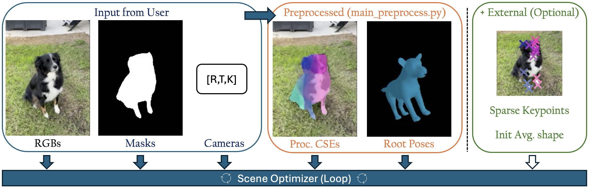

# Rendering 3D animals from videos for animation


## Installation

The code was developed with python=3.10 | pytorch=2.0.1 | pytorch-cuda=11.8 <br>
Install the following libs:
1) [Install PyTorch](https://pytorch.org/get-started/locally/#start-locally).
2) [Install PyTorch3D](https://github.com/facebookresearch/pytorch3d/blob/main/INSTALL.md)
3) [Install Lightplane](https://github.com/facebookresearch/lightplane?tab=readme-ov-file#installation)
4) [Install DensePoseCSE](https://github.com/facebookresearch/detectron2/blob/main/projects/DensePose/doc/GETTING_STARTED.md#installation-as-a-package)

Additional pip install:

```python
pip install pandas sqlalchemy plotly hydra-core tensorboard lpips opencv-python imageio[ffmpeg]
```

Please download [external_data/](https://github.com/RemySabathier/animalavatar.github.io/raw/main/external_data/external_data.zip) and add the following files to "external_data/" folder:

Download SMAL model from ["BITE: Beyond priors for improved three-D dog pose estimation"](https://github.com/runa91/bite_release):
* [my_smpl_39dogsnorm_newv3_dog.pkl](https://owncloud.tuebingen.mpg.de/index.php/s/BpPWyzsmfycXdyj/download?path=%2Fdata%2Fsmal_data%2Fnew_dog_models&files=my_smpl_39dogsnorm_newv3_dog.pkl&downloadStartSecret=21p5mlf8old)
* [symmetry_inds.json](https://owncloud.tuebingen.mpg.de/index.php/s/BpPWyzsmfycXdyj/download?path=%2Fdata%2Fsmal_data&files=symmetry_inds.json&downloadStartSecret=ecjw1bt2rbv)

Download Densepose model weight and configs:
* [densepose_rcnn_R_50_FPN_soft_animals_I0_finetune_i2m_16k.yaml](https://raw.githubusercontent.com/facebookresearch/detectron2/main/projects/DensePose/configs/cse/densepose_rcnn_R_50_FPN_soft_animals_I0_finetune_i2m_16k.yaml)
* [Base-DensePose-RCNN-FPN.yaml](https://raw.githubusercontent.com/facebookresearch/detectron2/main/projects/DensePose/configs/cse/Base-DensePose-RCNN-FPN.yaml)
* [model_final_8c9d99.pkl](https://dl.fbaipublicfiles.com/densepose/cse/densepose_rcnn_R_50_FPN_soft_animals_I0_finetune_i2m_16k/270727461/model_final_8c9d99.pkl)


External data folder should look as follows:

```bash
├── external_data/
│   ├── cse/
│   │   ├── Base-DensePose-RCNN-FPN.yaml
│   │   ├── cse_embedding.pk
│   │   ├── densepose_rcnn_R_50_FPN_soft_animals_I0_finetune_i2m_16k.yaml
│   │   └── model_final_8c9d99.pkl
│   ├── init_pose/
│   │   ├── ...
│   ├── lbos/
│   │   ├── lbo_cse_to_smal.pk
│   │   ├── lbo_cse.pk
│   │   └── lbo_smal.pk
│   ├── refined_masks/
│   │   ├── ...
│   ├── smal/
│   │   ├── my_smpl_39dogsnorm_newv3_dog.pkl
│   │   └── symmetry_inds.json
│   ├── sparse_keypoints/
│   │   ├── ...
│   ├── textures/
│   │   ├── texture_cse.pk
│   │   └── texture_smal.pk
```

The project was developed for the [CoP3D](https://github.com/facebookresearch/cop3d) dataset. Follow [instructions](https://github.com/facebookresearch/cop3d#download) to download CoP3D.

## Set-up paths

In **config/keys.py**, manually enter the path where you store external data, and the path of the CoP3D dataset on your machine.

## Optimize a CoP3D scene



### 1- Preprocessing

Before reconstructing a scene, you must preprocess the video sequence to extract a **CSE map** and a **root orientation** per frame.

```python
#Example code to process the CoP3D sequence "1030_23106_17099"
python main_preprocess_scene.py -sequence_index "1030_23106_17099" --visualize
```

A visualization of the processed CSE map and root orientation is saved in the preprocessing folder. For a subset of CoP3D scenes (list available in "config/keys.py"), we provide in **external_data/** refined masks, init shape and sparse keypoints per frame.

### 2- Launch Reconstruction (Optimizer)

The optimization framework **SceneOptimizer** propose a general framework to optimize the reconstruction of a scene given multiple modalities. Our implementation, aligned with **AnimalAvatar**, contains several losses available in **scene_optim/losses_optim**.


To launch the optimization on a CoP3D scene:

```python
#Example code to optimize the CoP3D sequence "1030_23106_17099" and save it in folder experiments/
python main_optimize_scene.py 'exp.sequence_index="1030_23106_17099"' 'exp.experiment_folder="experiments"'
```

Parameters of the reconstruction are accessible in the config file config/config.yaml

### 3- Visualize Reconstruction

To visualize reconstruction of a trained model:

```python
python main_visualize_reconstruction.py  "path_of_the_reconstruction_folder"
```

## Optimize a Custom scene

**AnimalAvatar** scene-optimizer relies on the following inputs:
  - Ground-truth RGB images
  - Ground-truth masks
  - Ground-truth cameras (intrinsics & extrinsics)

To launch **AnimalAvatar** on a custom video, fill **CustomSingleVideo** in *data/custom_dataloader.py* with your data, and launch AnimalAvatar with 'CUSTOM' dataset option:

```python
# 1- Preprocess the custom scene (to get CSE map and root orientation per frame)
python main_preprocess_scene.py -sequence_index "XXX_XXX_XXX" --custom --visualize
# 2- Launch the reconstruction
python main_optimize_scene.py 'exp.sequence_index="XXX_XXX_XXX"' 'exp.dataset_source="CUSTOM"' 'exp.l_optim_sparse_kp=0'
# 3- Visualize the reconstruction
python main_visualize_reconstruction.py "path_of_the_custom_reconstruction_folder" --custom
```

* If your scene is missing cameras, we recommend using [VGGSfM](https://github.com/facebookresearch/vggsfm). <br>
* If your scene is missing masks, we recommend using [Segment-Anything](https://github.com/facebookresearch/segment-anything) <br>

Code will be added to help through this process.

